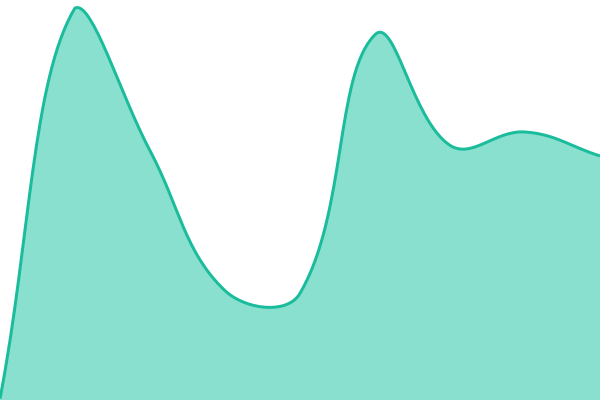
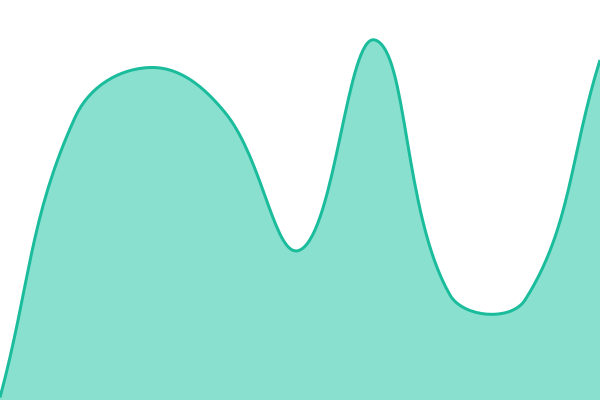

# [📈 Live Status](https://status.bastamp.com): <!--live status--> **🟩 All systems operational**

This repository contains the open-source uptime monitor and status page for [BA-BlockchainAnalysis](https://status.bastamp.com), powered by [Upptime](https://github.com/upptime/upptime).

With [Upptime](https://upptime.js.org), you can get your own unlimited and free uptime monitor and status page, powered entirely by a GitHub repository. We use [Issues](https://github.com/BA-BlockchainAnalysis/bastamp-status/issues) as incident reports, [Actions](https://github.com/BA-BlockchainAnalysis/bastamp-status/actions) as uptime monitors, and [Pages](https://status.bastamp.com) for the status page.

<!--start: status pages-->
<!-- This summary is generated by Upptime (https://github.com/upptime/upptime) -->
<!-- Do not edit this manually, your changes will be overwritten -->
<!-- prettier-ignore -->
| URL | Status | History | Response Time | Uptime |
| --- | ------ | ------- | ------------- | ------ |
|  [BA Stamp Website](https://bastamp.com) | 🟩 Up | [ba-stamp-website.yml](https://github.com/BA-BlockchainAnalysis/bastamp-status/commits/HEAD/history/ba-stamp-website.yml) | 

 1321ms
     
 | 

<a href="https://status.bastamp.com/history/ba-stamp-website">100.00%</a>
    

|  [BA Stamp App](https://bastamp.com/docs/api) | 🟩 Up | [ba-stamp-app.yml](https://github.com/BA-BlockchainAnalysis/bastamp-status/commits/HEAD/history/ba-stamp-app.yml) | 

 241ms
     
 | 

<a href="https://status.bastamp.com/history/ba-stamp-app">100.00%</a>
    

|  [Polygon RPC (publicnode)](https://polygon-bor-rpc.publicnode.com) | 🟩 Up | [polygon-rpc-publicnode.yml](https://github.com/BA-BlockchainAnalysis/bastamp-status/commits/HEAD/history/polygon-rpc-publicnode.yml) | 

 123ms
     
 | 

<a href="https://status.bastamp.com/history/polygon-rpc-publicnode">100.00%</a>
    

|  [OpenTimestamps Calendar](https://alice.btc.calendar.opentimestamps.org) | 🟩 Up | [open-timestamps-calendar.yml](https://github.com/BA-BlockchainAnalysis/bastamp-status/commits/HEAD/history/open-timestamps-calendar.yml) | 

 811ms
     
 | 

<a href="https://status.bastamp.com/history/open-timestamps-calendar">100.00%</a>
    

<!--end: status pages-->

[**Visit our status website →**](https://status.bastamp.com)

## 📄 License

- Powered by: [Upptime](https://github.com/upptime/upptime)
- Code: [MIT](./LICENSE) © [Anand Chowdhary](https://anandchowdhary.com)
- Data in the `./history` directory: [Open Database License](https://opendatacommons.org/licenses/odbl/1-0/)
